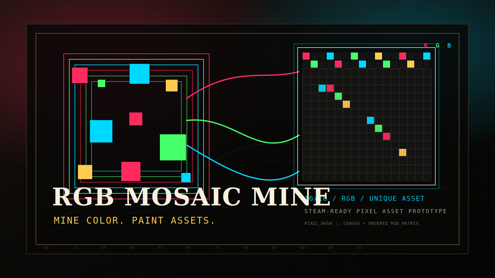

# RGB 马赛克资产游戏



RGB 马赛克资产游戏是一个网页端 MVP 原型。玩家通过自动挖矿获得 RGB 色块，把色块作为可消耗颜料填入 `16x16` 像素画布。作品完成后可以鉴定为平台内唯一资产。

当前阶段只验证前端玩法闭环，不做桌面壳、后端服务、真实交易或 Steam 接入。

仓库地址：`https://github.com/ml1027175683/MskGames.git`

## 当前范围

当前版本聚焦一个可运行、可测试的网页 MVP：

1. 自动挖矿产出 RGB 色块。
2. 色块库存按 RGB 叠放并展示稀有度。
3. 玩家创建、命名、编辑、重命名和删除未鉴定画作。
4. 填色会消耗库存，覆盖像素会返还旧颜色。
5. 完整作品可鉴定为唯一资产。
6. 重复像素矩阵不能重复鉴定。
7. 本地 `localStorage` 保存库存、画作和资产。

## 不在当前范围

以下内容暂不进入当前前端验证阶段：

1. Windows `.exe` 桌面壳。
2. Tauri、Electron 或其他桌面打包方案。
3. 后端 API、账号系统和云存档。
4. 平台内市场交易、支付、拍卖、报价或求购。
5. Steam 登录、Steam Inventory 或 Steam Community Market 接入。
6. NFT、链上资产或真实货币交易。
7. 大于 `16x16` 的画布。

桌面客户端和后端会在网页 MVP 验证稳定后重新评估。

## 当前已实现

| 模块 | 当前能力 |
| --- | --- |
| 挖矿 | 默认进入挖矿页，系统自动产出 RGB 色块 |
| 产出记录 | 只展示最近 10 条挖矿记录 |
| 颜色等级 | 7 级稀有度：普通、优良、稀有、精粹、史诗、传说、棱晶 |
| 代表色图鉴 | 7 个等级共 56 个代表色，未拥有颜色显示数量 0 |
| 色块库存 | 相同 RGB 按数量叠放，可查看等级和数量，并可切换仅显示可用颜色 |
| 画作库存 | Steam 风格库存页，只展示未鉴定草稿 |
| 作品详情 | 继续创作、鉴定、重命名和删除集中在右侧详情面板 |
| 新建画作 | 新建作品必须命名，未鉴定草稿最多 5 个 |
| 画布 | 独立 `16x16` 像素画布，共 256 个像素 |
| 填色 | 消耗选中色块，覆盖像素返还旧颜色 |
| 自动保存 | 填色后自动保存，无保存按钮 |
| 画布缩放 | 支持 `50%` 到 `3200%` 缩放 |
| 鉴定 | 完整作品播放像素扫描并生成资产记录 |
| 资产库 | 展示已鉴定资产卡片和只读资产详情 |
| 唯一性 | 相同像素矩阵不能重复鉴定 |
| 删除规则 | 用户新建未鉴定草稿可删除并返还色块；内置作品不可删除，已鉴定作品进入资产库 |
| 本地保存 | 保存颜色库存、画作、资产、当前选中作品和挖矿总数 |
| 测试 | Vitest + Testing Library 覆盖核心页面和 RGB 领域规则 |

## 核心玩法循环

```text
自动挖矿产出 RGB 色块
-> 色块进入玩家库存
-> 玩家创建或选择未鉴定画作
-> 在 16x16 画布上消耗色块填色
-> 完整作品发起鉴定
-> 前端校验像素矩阵唯一性
-> 鉴定成功后生成平台内资产记录
-> 从资产库查看资产详情
```

当前唯一性仍是前端本地校验。后续接入后端后，唯一性、防作弊和资产生成必须迁移到可信服务端。

## 技术栈

| 类型 | 技术 |
| --- | --- |
| 前端 | Vite + React + TypeScript |
| 测试 | Vitest + Testing Library |
| 样式 | CSS |
| 存储 | localStorage |
| 包管理 | npm |

## 本地运行

Windows PowerShell 环境下建议使用 `npm.cmd`，避免系统脚本执行策略拦截 `npm.ps1`。

```bash
npm.cmd install
npm.cmd run dev
```

macOS、Linux 或没有 PowerShell 脚本限制的环境可以使用常规 npm 命令：

```bash
npm install
npm run dev
```

启动后按终端输出访问本地 Vite 地址。

## 常用命令

Windows PowerShell：

```bash
npm.cmd install
npm.cmd run dev
npm.cmd test
npm.cmd run test:watch
npm.cmd run build
npm.cmd run preview
```

命令说明：

| 命令 | 作用 |
| --- | --- |
| `npm.cmd install` | 安装依赖 |
| `npm.cmd run dev` | 启动本地开发服务器 |
| `npm.cmd test` | 运行测试 |
| `npm.cmd run test:watch` | 以监听模式运行测试 |
| `npm.cmd run build` | 执行 TypeScript 检查并构建生产版本 |
| `npm.cmd run preview` | 本地预览生产构建 |

## 交互说明

1. 默认进入挖矿页，矿机会自动产出 RGB 色块。
2. 进入库存页后，可在色块库存中查看代表色图鉴和已有数量。
3. 切换到画作库存后，可查看内置哥布林、皮卡丘和玩家新建的未鉴定草稿。
4. 点击画作卡片只切换右侧详情，不直接进入编辑。
5. 未鉴定作品可从详情继续创作。
6. 作品重命名和删除入口位于详情右上角 `...` 菜单。
7. 顶部进入画布不会自动新建作品，需要命名新建或选择未鉴定作品。
8. 在画布页选择可用色块，再点击像素即可填色；需要查图鉴时可切换显示全部颜色。
9. 每次填色自动保存。
10. 完整作品可在详情页鉴定，鉴定后从画作库存移入资产库。
11. 鉴定结果可跳转到资产库，查看资产编号、指纹、拥有者和关联作品。

## 项目结构

```text
src/
  App.tsx                 # 当前前端原型入口和页面交互
  App.test.tsx            # 页面级行为测试
  styles.css              # 页面布局、库存、画布和像素预览样式
  domain/
    rgb.ts                # RGB 颜色、稀有度、代表色和像素哈希领域规则
    rgb.test.ts           # RGB 领域规则测试
docs/
  assets/                 # README 海报和视觉说明资源
  product/                # 产品文档
  design/                 # 前端与系统设计文档
  superpowers/specs/      # 早期设计草案
```

## 项目文档

产品文档：

`docs/product/rgb-mosaic-product.md`

设计文档：

`docs/design/rgb-mosaic-frontend-design.md`

早期设计草案：

`docs/superpowers/specs/2026-05-06-rgb-mosaic-asset-game-design.md`

海报视觉说明：

`docs/assets/rgb-mosaic-poster-philosophy.md`

## 提交前验证

当前推荐在提交前至少运行：

```bash
npm.cmd test
npm.cmd run build
```

## 后续路线

建议按以下顺序推进：

1. 继续验证前端玩法闭环和边界规则。
2. 抽离游戏状态和领域操作，为后端 API 做边界准备。
3. 设计 Go 后端 MVP，把挖矿、防作弊、资产唯一性迁移到服务端。
4. 增加市场原型和资产流转规则。
5. 在网页 MVP 稳定后重新评估桌面客户端方案。
6. 在资产模型稳定后再评估 Steam Inventory / Steam Market 映射。

## 风险边界

当前项目是游戏玩法与资产系统原型，不承诺任何真实交易、投资收益或外部平台接入。Steam、市场和链上相关内容均为长期技术预留，不代表当前版本已经具备这些能力。
